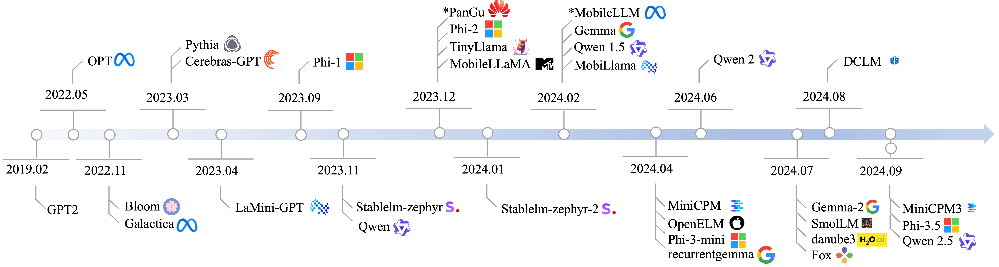
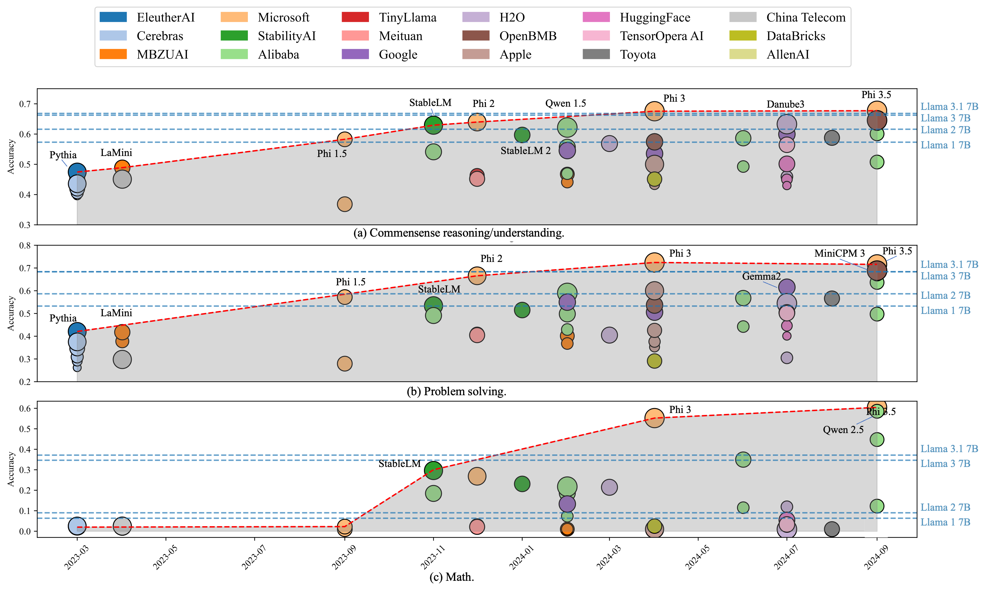
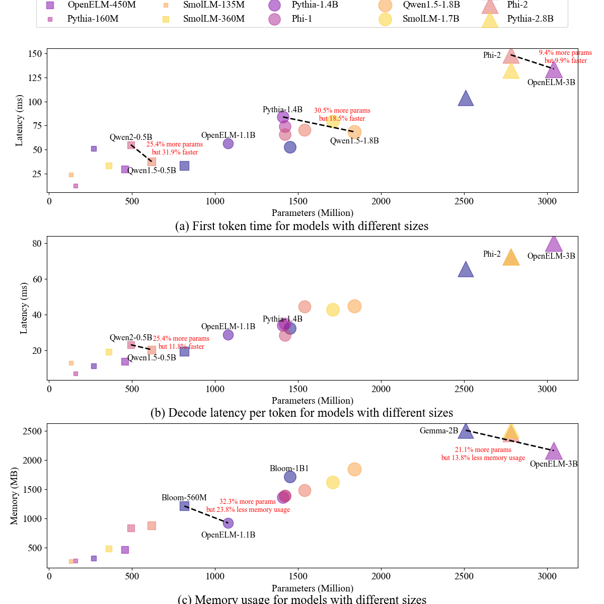

# Small Language Models: Survey, Measurements, and Insights

This repo contains the figures for [Small Language Models: Survey, Measurements, and Insights](https://arxiv.org/abs/2409.15790).

## Abstract

Small language models (SLMs), despite their widespread adoption in modern smart devices, have received significantly less academic attention compared to their large language model (LLM) counterparts, which are predominantly deployed in data centers and cloud environments. While researchers continue to improve the capabilities of LLMs in the pursuit of artificial general intelligence, SLM research aims to make machine intelligence more accessible, affordable, and efficient for everyday tasks. Focusing on transformer-based, decoder-only language models with 100M–5B parameters, we survey 59 state-of-the-art open-source SLMs, analyzing their technical innovations across three axes: architectures, training datasets, and training algorithms. In addition, we evaluate their capabilities in various domains, including commonsense reasoning, in-context learning, mathematics, and coding. To gain further insight into their on-device runtime costs, we benchmark their inference latency and memory footprints. Through in-depth analysis of our benchmarking data, we offer valuable insights to advance research in this field.

## Scope and rationales

- We only collect models with decoder-only transformer architecture (which can be traced to GPT-2), for their superior performance and real-world deployment. Currently we do not include variants of transformers such as RWKV and Mamba. 
- We only collect SLMs with open weights, so that we can evaluate them.
- The weight range of SLMs in this work is defined between 100M to 5B. 
- The survey mainly focuses on the base knowledge obtained from pre-training process, thereby we only collect the base models of SLMs, except those provided only the instruct versions (Microsoft Phi and StabilityAI StableLM). We also exclude models that are fine-tuned on other pre-trained models.

## Overview of SLMs

## SLM Capabilities

## SLM Runtime Cost

## SLM Architecture and Datasets
- The architecture

- The usage frequency of datasets from 2022 to 2024

